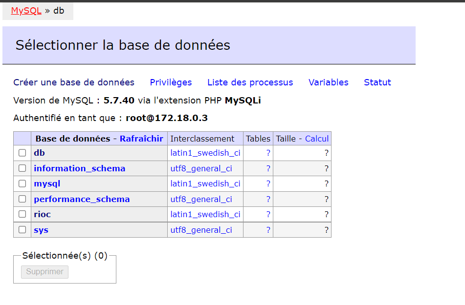
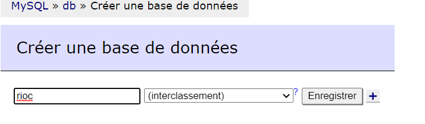
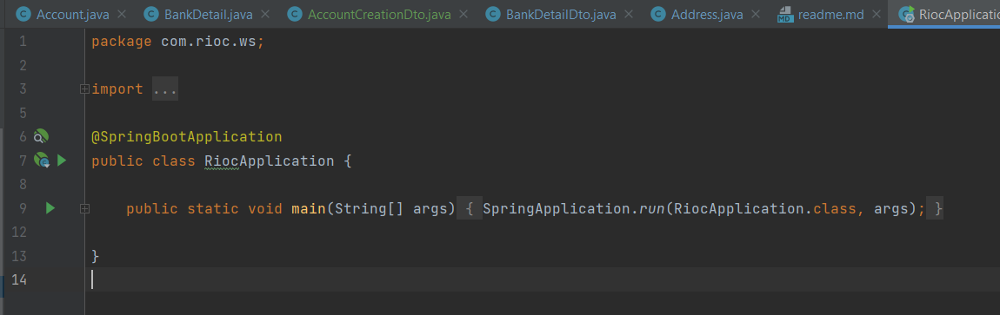
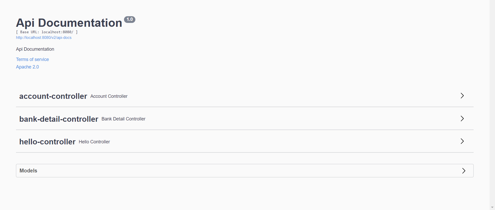

<!-- create readme -->

# README

This a spring boot application that uses the following technologies:

* Spring Boot
* Spring Data JPA
* MySQL
* MVC Architecture

## Table of Contents

- [README](#readme)
  - [Table of Contents](#table-of-contents)
  - [Introduction](#introduction)
  - [Getting Started](#getting-started)
  - [Troubleshooting](#troubleshooting)
  - [Contributing](#contributing)
  - [License](#license)

## Introduction

Here is a brief introduction to the project.

## Getting Started
# Requirements

- Java 17
- Maven 3.8.1
- Docker 20.10.8
- Docker Compose 1.29.2
- Spring Boot 2.7.5

If it's not possible to install the above requirements, you can use your own MySQL database and change the `application.properties` file.

- MySQL 5.7

Follow these steps to get your development environment set up:

1. Fork this repository to your GitHub account and then clone it to your local device
2. Open the project in your IDE
3. If you want to use your own MySQL database, change the `application.properties` file
4. Here is an example of the `application.properties` file:

Do not forget to change the `spring.datasource.username` and `spring.datasource.password` properties.

```properties
spring.datasource.url=jdbc:mysql://localhost:3306/rioc
spring.datasource.username = root
spring.datasource.password = root
```
5. If not run the following command to start the MySQL database:

```bash
docker-compose up -d
```
6. Create the database:

Go to the following URL (adminer): http://localhost:8081/

It will allow you to create the database from a GUI interface.

Like so :



Click on the Create database button, you will name the database `rioc` and click on the register button.

Like so :



If you want to use your own MySQL database, you will have to create the database manually.
For example, you can use the following command:

```bash
mysql -u root -p
```

Then, you will have to create the database:

```sq
CREATE DATABASE rioc;
```

7. Run the following command to start the application:

```bash
mvn spring-boot:run
```

Or with your IDE go to the `RiocApplication.java` file and run it.

Like so :



8. Go to the following URL: http://localhost:8080/swagger-ui/index.html

You will see the Swagger UI:



9. You can now use the API.

Here are a quick summary of the features:

- Account Controller
  - Create an account
  - Get an account by id
  - Update an account
  - Delete an account
  - Get all accounts
  - Create Multiple Accounts
  - Delete All Accounts
- BankDetails Controller
  - Create a bank details
  - Get a bank details by id
  - Delete a bank details
  - Get all bank details
  - Get all bank details by account id
- Hello Controller
  - Hello World
  - Hello World with name

Some features implemented in the project:
- Account **one to one** relationship with address.
- Account **one to many** relationship with bank details.
- Bank details **many-to-one** relationship with account.
- Check if the **account exists** before deleting it, updating it or getting it.
- Check if the **bank details exists** before deleting it or getting it.
- Check if the **address is existing** before creating a new account. **With an API**.
  - Check if the API output data (if the address is existing).
  - If the address is existing, we check the score and only if the score is greater than 0.65, we create the account.
- Check if the **IBAN number is valid** before creating a new bank details.
- Deleting **all bank details and addresses** when deleting an account.
- **Encrypting** the password, IBAN and address before saving it in the database.
  - Encrypting the password with **Cipher**(AES 128).
- **Decrypting** the password, IBAN and address before getting it from the database.
  - Decrypting the password with **Cipher**(AES 128).
- Check if the **IBAN number already exists** in the database before creating a new bank details.
- Update the account only **if the data has changed**.
- Documentation and examples with Swagger.
- Output the password only when **creating or updating** an account.
- **Validate the data** before creating or updating an account.

## Troubleshooting

  If you run into problems please try to do a mvn clean install and then try again.

```bash
mvn clean install -DskipTests
```

Feel free to open an issue if you have any questions or problems.

## Contributing

Grégoire GUILLE

GitHub: https://github.com/KnockAce/SpringBootProject

## License

No license is specified for this project.